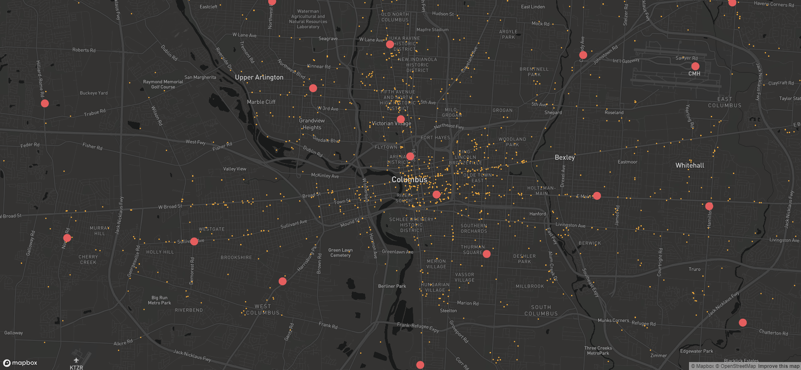

## Introduction
Last year, [Smart Columbus Open Data Enthusiats (SCODE)](https://www.scodemeetup.org/) was issued an [Open Design Challenge](https://github.com/SCODEMeetup/locator-jekyll/blob/release-v2.0/HACKABLE-SNACK.md). The challenge was to help people find and access
Community Services using data from the [Smart Columbus Operating System (SCOS)](https://www.smartcolumbusos.com/). SCODE members could build an interactive map, displaying locations of active service providers where users could navigate the map by location, service provider, and service offerings.

Below are the links are to the initial visualization submissions:
- [Heroku Locator](https://cbus-community-service-locator.herokuapp.com/)
- [Jupyter Notebook Locator](https://github.com/SCODEMeetup/community-services-locator-ui-2)

What follows are a collection of lessons learned from the SCODE teams and their members.

---
## Data Analysis Team
### Entity Relationship Diagram
The initial analysis started with looking at the files listed on the Open Design Challenge and understanding how they related to one another. The 4 comma-separated values (CSV) files are part of the [Food Pantry and User Data](https://ckan.smartcolumbusos.com/dataset/food-pantry-and-user-data) dataset on the SCOS. That dataset is provided by [HandsOn Central Ohio](https://handsoncentralohio.org/), and is comprised of 34 CSVs in total. The files used in the analysis all have an ACTIVE_FLAG (Y/N) field, we are only displaying active records in our visualizations.

| Listed            | Actual            |
|:-:                |:-:                |
| Agency            | Agency            |
|                   | Agency Location   |
|                   | Agency Service    |
| Service Location  |                   |
| Service Taxonomy  | Service Taxonomy  |
| Taxonomy          | Taxonomy          |

The Agency file links all the other files together, it is where the AGENCY_ID primary key (PK) resides. The Service Location file contains contact information and has a foreign key (FK) reference to Agency Location. Agency Location lists the physical address of said agency. The Agency Service file describes the services the agency offers. The Service Taxonomy file has a composite key that lets the Agency Service and Taxonomy files uniquely identify a record. Lastly, the Taxonomy file provides TAXON_ID (PK) and TAXONOMY LEVEL. 

The diagram can be read as follows:
1. An agency (can) have "zero, one, or many" location(s).
2. An agency (can) provide "one or many" service(s).
3. An agency service (can) have "one or many" taxonomies.

- [Jesse Mathews](https://www.linkedin.com/in/jesse-mathews-20662450/)

---
## Application Program Interface Team
- Vijay's comments
- Mihir's comments
- Eddie's comments

---
## User Interface Team
- Mihir's comments
- Adam's comments: One approach to visualizing these locations on a map is to use React and Mapbox to manage the data as a Vector Tileset. In order for a dataset to be converted to a Vector Tileset, it needs values for Longitude and Latitude, and since the initial dataset do not have these values, they can be run through a Jupyter Notebook in order to produce these values. From there, Mapbox provides a free tool to upload that data, and convert it into a Vector Tileset. Vector Tilesets are built to work with more front-end mapping frameworks, and reduce work needed to render the data into a map. From this point, a relatively minimal React frontend is used to populate the data on the map. A benefit of this approach is that a query made on the front end can search through the data for these points without the need to talk to the OS since that data is included in the Vector Tileset, although that component of the UI hasn't been implemented yet.

  - Data: Food Bank [Agency Locations](https://ckan.smartcolumbusos.com/dataset/b0390b58-35c9-45e8-8a2d-d2472b20d65f/resource/570a8e02-fb0e-4cee-895b-3b32bd740650/download/agency_location.csv)
  - Dataset uploaded through [jupyter notebook](https://jupyter.smartcolumbusos.com/user/ohioadam/lab/tree/Geocoder-to-CSV.ipynb) to geocode data, and saved as new csv
  - New csv uploaded to Mapbox as tileset (Map ID: mapbox://smrtcbus.9n1znhht)

